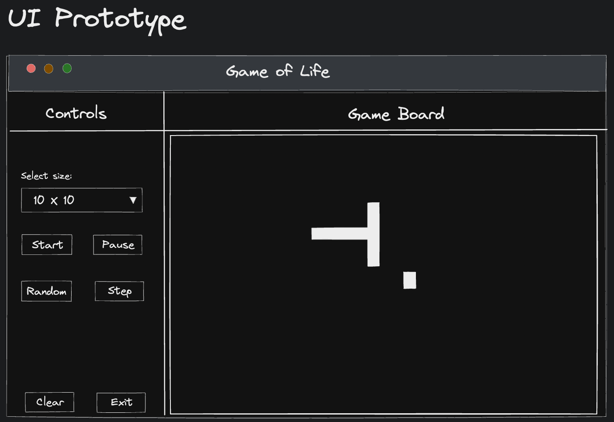
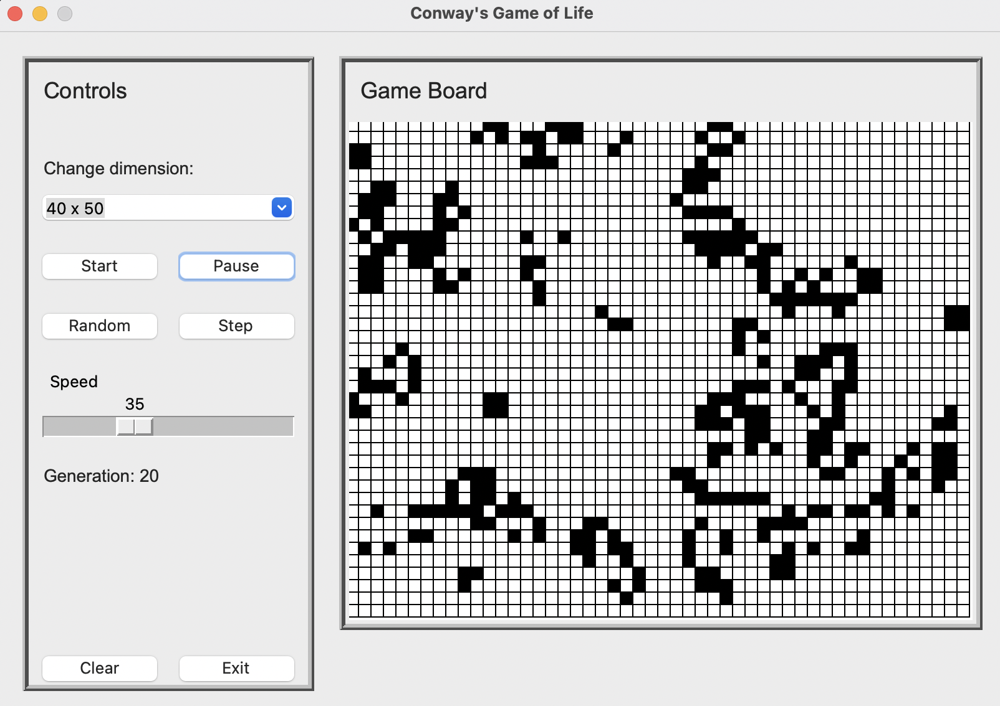

# Conway's Game of Life

This is my attempt to implement Conway's Game of Life, a cellular automaton created by mathematician John Conway in 1970. The game involves a grid of cells that can be in one of two states, either "alive" or "dead". The game evolves over time, with the state of each cell changing according to a set of rules.

Check the Wikipedia Page for more: [Game of life](https://en.wikipedia.org/wiki/Conway%27s_Game_of_Life)

This implementation uses an object-oriented approach and with Tkinter and TTK widgets for creating a graphical user interface.

## How it works

-   The base model class `Game` is implemented by the `GUI` class
-   The `GUI` class is responsible for creating the user interface, widgets, controls and events.
-   The `GuiManager` class is responsible for setting up the controls, and the Game board
-   The `GuiControls` class is responsible for creating the widgets (like Buttons, Slider)
-   The `GuiController` class is responsible for the implementing the logic

Read more on [TKinter](https://docs.python.org/3/library/tkinter.html)

## How to run it

To run this implementation of Conway's Game of Life, you'll need the following:

-   Python 3.x

### Usage

1.  Clone the repository to your local machine:

`git clone https://github.com/jamesawo/python-projects.git`

2.  Navigate to the project directory:

`cd conways-game-of-life`

3. To start the game, simply run the `main.py` file using Python:

`python3 main.py`

## User Interface

Here are some screenshots of the user interface:

---

## Demo

Here's a GIF showing the game in action:

I hope this helps you get started with your implementation of Conway's Game of Life in Python.

## Author

[Aworo James - james.aworo@outlook.com](james.aworo@outlook.com)
